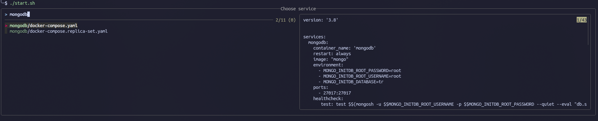

# docker-containers
A collection of docker compose and Docker files for development needs.

## Prerequisite 
- docker
- docker compose plugin or docker-compose script

## Running containers
- ### Using start script
    The starter script uses fzf, so make sure that fzf is installed. <br>
    The script is only tested in debian linux.

  - Run the script in your terminal via
    ```bash
    ./dc_start
    ```
  - Search for the container to run, and press enter 

- ### Manual
  - open your terminal and cd into required container directory
    ```bash
    cd mongodb
    ```
  - run the docker compose command with the available docker-compose files
    ```bash
    docker compose -f docker-compose.replica-set.yaml up --build -d
    ```

